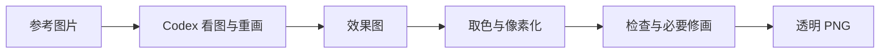

<h1 align="center">Picxel</h1>

<p align="center"><b>把参考图片，重新画成游戏里的像素素材。</b></p>

<p align="center">
  <a href="LICENSE"></a>
  
  
</p>

<!-- 头图与正式发布的 DOI 徽章准备好后添加。 -->

Picxel 是面向独立游戏开发者的像素素材工作流。GPT 先理解原图、重新绘制主体，本地算法再取色、整理成严格的像素网格，让素材在简化后仍然神似。

支持 **32×32、64×64、128×128** 透明 PNG。单张可观看色块显现演示，批量最多 20 张；面板支持中文和 English，结果保存在本机。

## 演示

> 演示视频准备中：从选图到导出，展示一次完整制作流程。

<!-- 在此放入实际录制的视频链接；色块演示不代表模型内部落笔顺序。 -->

## 如何开始

需要 **能调用生图工具的 Codex 会话**、Python 3.10+ 和 Pillow。Picxel 不额外要求 API key，图像生成使用当前会话的能力与额度。

1. [下载项目](https://github.com/See-Sol-Lab/Picxel/archive/refs/heads/main.zip)并解压，在 Codex 中打开这个文件夹。
2. 在对话里说：

   > 读取 SKILL.md，安装所需依赖并打开 Picxel 面板。

3. 在面板选图片、导出位置和尺寸，然后回到对话说：**按面板设置开始画。**

完成后点「打开成品图」，即可取走效果图与各尺寸 PNG。同一批图片放在同一个文件夹里，可以一次多选，也可以分次追加。

<details>
<summary>手动启动面板</summary>

```bash
python -m pip install Pillow
python scripts/picxel.py panel
```

默认地址：`http://127.0.0.1:8770/`。面板负责选图和展示，生成仍由 Codex 对话发起。

</details>

## 它怎么工作



模型负责主体辨识和绘画，本地代码负责色板、网格与格式校验。人物和动物按需检查眼口细节；最终是否适合游戏，由你看图决定。

详细操作见 [SKILL.md](SKILL.md)，格式与技术说明见 [SPEC.md](SPEC.md)。ComfyUI 用户可选装[导入／读回节点](comfyui/README.md)，把图片送入 Picxel，再将成品接回工作流。

## 反馈与贡献

欢迎提交 [Issue](https://github.com/See-Sol-Lab/Picxel/issues) 或 [PR](https://github.com/See-Sol-Lab/Picxel/pulls)。遇到问题时，附上复现步骤、目标尺寸和可公开的对比图，会更容易定位。

项目代码采用 [GPL-3.0-only](LICENSE)。生成的图片不会仅因使用本工具就受 GPL 约束；商业使用仍需遵守原始素材与模型服务的相关条款。

Copyright © 2026 See-Sol-Lab contributors.
