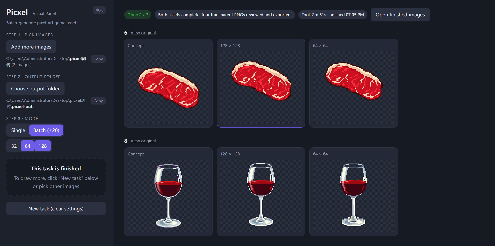

<h1 align="center">Picxel</h1>

<strong>English</strong> · <a href="README.zh.md">中文</a>

<b>Turn reference images into pixel-art game assets.</b>

  
  
  

<!-- Hero image and DOI badge will be added when ready. -->

Picxel helps indie game developers redraw references as recognizable game assets. GPT interprets the subject and directs the redraw; local algorithms turn the result into a precise pixel grid. Developed and tested primarily with GPT-6 Astra in Codex.

Export transparent **32×32, 64×64 or 128×128 PNGs**, with up to 16 colors per sprite. Use single-image reveal previews or batches of up to 20 images, in an English or Chinese panel.

## Demo

**[Watch the demo · 2:47](docs/media/picxel-demo.mp4?raw=true)** — From reference selection to transparent PNGs: a horse, followed by a two-image batch. Includes English subtitles and narration.

## Get started

You need a **Codex session with image-generation tools** and Python 3.10+. Picxel uses that session's tools and quota; it does not require a separate API key.

1. Ask Codex: **“Install Picxel from https://github.com/See-Sol-Lab/Picxel and follow its SKILL.md to complete setup.”** It should install the skill through the host's skill installer, prepare dependencies and show the panel.
2. Once installed, ask for your assets: **“Use $picxel to turn these references into game sprites.”** Picxel's first step is to prepare and open the panel automatically. You do not need a separate request to open it.
3. Choose images, an output folder and sizes; say **“Start with the panel settings.”** If you already supplied those choices in chat, the assistant can fill them in for you.

Click **Open finished images** to collect the concepts and PNGs. A batch uses one source folder; add images together or one at a time. Installing files alone does not run an idle assistant: setup or an asset request activates the workflow.

Already downloaded the repository? Open its folder in Codex and ask to create pixel-art assets; the project instructions route the assistant to the same workflow. If a newly installed skill is not listed, restart the Codex session. See [Codex skill discovery](https://developers.openai.com/codex/skills/).

## How it works

The skill coordinates the work. The image-processing code and targeted drawing rules improve specific stages:

| Stage | What Picxel improves |
|---|---|
| Before redrawing | A short keep/drop plan protects identity, pose and important details. Regional simplification reduces distracting texture when a preparation image is needed. |
| Background removal | Preserves real alpha. With an explicitly chosen key color, removes that background and narrowly cleans matching edge spill while protecting dark outlines. |
| Palette selection | Counts source colors at full resolution and compares perceived color differences in Oklab. Important regions get more weight; transparent pixels and uncertain edges get less. Selected colors come from the image. |
| Pixel conversion | Pads the visible silhouette and snaps colors before voting within each grid cell. Similar shades vote together; transparent coverage is counted separately, reducing broken shapes and color noise. |
| Local cleanup and faces | Merges close-colored specks while retaining high-contrast details. For complex faces, the assistant checks gaze and expression and applies constrained eye/mouth patches only when needed; eyebrows remain intact. |
| Efficient finishing | One concept and palette serve all requested sizes. Shared decoding and a combined review sheet reduce repeated work; only observed defects are repaired. |

Face interpretation is the assistant's visual judgment, not an automatic face detector. Grid alignment experiments are not enabled. You decide whether the final art fits your game.

Details: [assistant workflow](SKILL.md) · [technical specification](SPEC.md) · [optional ComfyUI import/export nodes](comfyui/README.md).

## Feedback and contributions

[Issues](https://github.com/See-Sol-Lab/Picxel/issues) and [PRs](https://github.com/See-Sol-Lab/Picxel/pulls) are welcome. Include reproduction steps, target sizes and comparison images you can share publicly.

Project code is licensed under [GPL-3.0-only](LICENSE). Generated images do not become GPL-covered merely because you use this tool; commercial use still depends on the rights to your inputs and the image provider's terms.

Copyright © 2026 See-Sol-Lab contributors.
