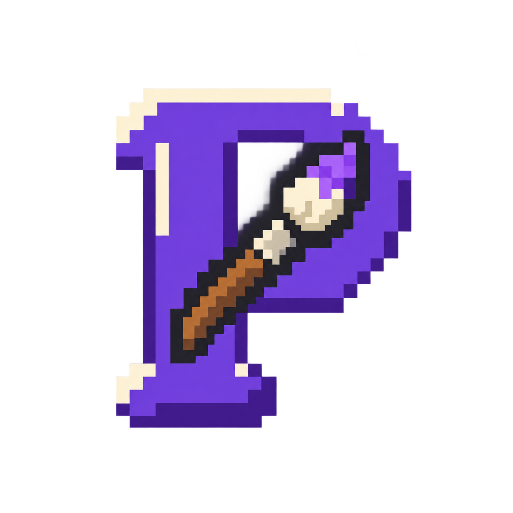
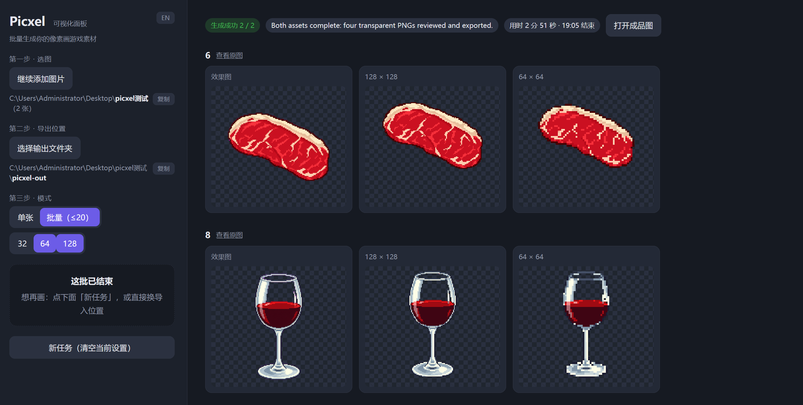
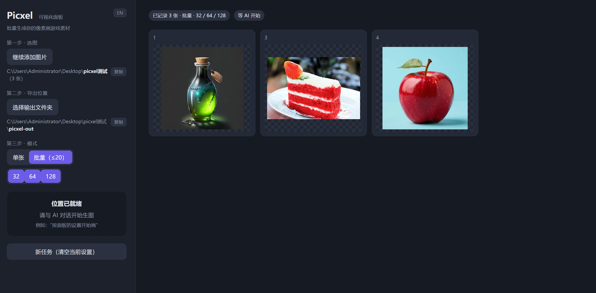
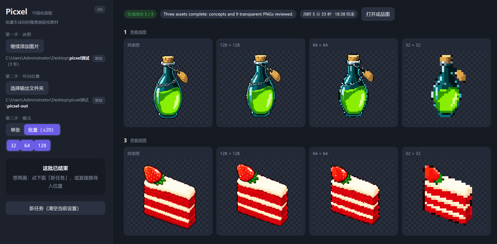
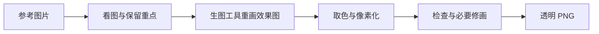

<h1 align="center">Picxel</h1>

<a href="README.md">English</a> · <strong>中文</strong>

<b>把参考图片，重新画成游戏里的像素素材。</b>

  
  
  

<!-- Hero image and DOI badge will be added when ready. -->

Picxel 面向独立游戏开发者。GPT 理解原图并组织重绘，本地算法再取色、整理成严格的像素网格，让素材在简化后仍然神似。主要使用 Codex 中的 GPT-6 Astra 开发与实测。

支持 **32×32、64×64、128×128** 透明 PNG，每张最多 16 色。单张可观看色块显现演示，批量最多 20 张，面板支持中文和 English。

## 演示

**[观看演示 · 2 分 47 秒](https://www.youtube.com/watch?v=NKvPYOulPvI)** — 从选图到导出透明 PNG：先制作马的素材，再批量生成两张道具。视频配有英文字幕与旁白。

## 从参考图到像素成品

在面板中选择参考图片：

从左到右对比重绘效果图与 **128、64、32 像素**成品：

## 如何开始

需要 **能调用生图工具的 Codex 会话**和 Python 3.10+。Picxel 使用当前会话的能力与额度，不额外要求 API key。

1. 对 Codex 说：**“从 https://github.com/See-Sol-Lab/Picxel 安装 Picxel，并按照它的 SKILL.md 完成初始化。”** AI 应通过宿主的技能安装工具完成安装，准备依赖并展示面板。
2. 安装后直接提出素材需求，例如：**“用 $picxel 把这些参考图做成游戏像素素材。”** 流程第一步就是主动准备并打开面板，不用另说“打开面板”。
3. 在面板选图片、导出位置和尺寸，再说：**“按面板设置开始画。”** 如果已在对话中说明这些选择，AI 可以直接填好。

完成后点「打开成品图」，取走效果图与 PNG。同一批图片来自同一个文件夹，可一次多选或分次追加。安装文件本身不会让空闲的 AI 自动执行；初始化或素材任务会触发这套流程。

已经下载仓库？在 Codex 中打开项目目录，直接提出像素素材需求，项目指引会进入同一流程。如果新安装的技能尚未出现，重启 Codex 会话。详见 [Codex 技能发现机制](https://developers.openai.com/codex/skills/)。

## 它怎么工作

Skill 负责组织流程，本地算法与针对性的绘画规则负责优化具体环节：

| 环节 | 我们优化了什么 |
|---|---|
| 重画之前 | 用简短的保留／舍弃清单抓住身份、姿势和关键细节；需要预处理图时，按区域简化纹理，减少干扰。 |
| 去背景 | 保留真实透明度；明确指定技术底色时去除背景，并只在窄边缘清理同色残留，保护深色轮廓。 |
| 取色 | 在完整分辨率统计颜色，用 Oklab 比较人眼感受到的色差；重点区域优先，透明像素与不确定边缘少参与，色板保留原图中的实际颜色。 |
| 像素化 | 给主体留边距，先把相近颜色归入色板，再逐格投票；透明覆盖单独计算，减少碎色、轮廓断裂和细节丢失。 |
| 局部清理与五官 | 合并近色杂点，保留高对比细节；复杂面部由 AI 看图判断视线与神态，必要时只对眼口做受限修画，保留眉毛。 |
| 减少返工 | 同一效果图和色板用于多个尺寸，共享解码结果；总览一次检查整批，只修实际出现的问题。 |

面部判断来自 AI 看图，不是程序自动检测五官；网格对齐实验没有启用。成品是否适合你的游戏，最终由你判断。

详细说明：[助手工作流](SKILL.md) · [技术规格](SPEC.md) · [可选 ComfyUI 导入／读回节点](comfyui/README.md)。

## 反馈与贡献

欢迎提交 [Issue](https://github.com/See-Sol-Lab/Picxel/issues) 或 [PR](https://github.com/See-Sol-Lab/Picxel/pulls)。附上复现步骤、目标尺寸和可公开的对比图，会更容易定位问题。

项目代码采用 [GPL-3.0-only](LICENSE)。生成的图片不会仅因使用本工具就受 GPL 约束；商业使用仍需遵守原始素材与模型服务的相关条款。

Copyright © 2026 See-Sol-Lab contributors.
